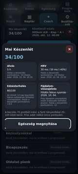

# TrainPilot

> **Private commercial repository.** TrainPilot is proprietary software by FulTech Studios. Source access does not grant permission to copy, modify, redistribute, publish, sublicense, or sell the code.

TrainPilot is a local-first Android workout planner, workout log and training companion. It combines configurable training programs, progress tracking, cardio/distance sessions, a readiness-aware Coach, Health Connect integration and optional Google backup/calendar features.

**Current stable release:** **1.2.6 / Android versionCode 2709**  
**Application ID:** `com.repforge.app`  
**Android target:** API 36

## Highlights

- Custom workout programs and quick workouts.
- Editable sets, repetitions, load, timed/bilateral exercises and progressive targets.
- Persistent workout Journal with exercise-level editing, statistics, personal records and cardio metrics.
- TrainPilot Coach with readiness explanations based on the signals actually available.
- Calendar planning and reviewed replanning of missed/upcoming workouts.
- Distance activities with manual distance, indoor timing and optional foreground GPS measurement.
- Health Connect support for workout-window steps and a persistent native health journal.
- Optional remembered-watch BLE/RDFit integration for verified watch step snapshots.
- Optional Google Drive `appDataFolder` backup and Google Calendar synchronization.
- Private workout photos stored in app-owned storage, with optional backup.
- Hungarian, English, German and Romanian UI.

## Current 1.2.6 release

The 1.2.6 release focuses on the Health journal, Calendar replanning and Coach readiness details.

Health Connect data is stored in a transactional native journal. Daily summaries avoid adding overlapping origins together, while measurement records remain inspectable separately. Calendar dates open a dedicated day dialog, replanning protects completed/logged/active sessions, and tapping the Coach readiness score opens the inputs and point effects used by the existing readiness formula.

Release notes: [docs/releases/v1.2.6.md](docs/releases/v1.2.6.md)

## Screenshots

| Home | Coach readiness |
| --- | --- |
|  |  |

Screenshots are CI-generated examples from the current TrainPilot UI. Language, theme and data shown may vary by test fixture.

## Architecture

TrainPilot uses a Capacitor-based Android shell with a local WebView UI and targeted native Android integrations.

- `www/` — application UI/runtime and local-first data model.
- `android/` — native Android project and Capacitor plugins.
- `tests/` — Node compatibility/regression tests.
- `tests/browser/` — Chromium end-to-end UI regressions.
- `docs/` — release, privacy, Health Connect, performance and publishing documentation.
- `.github/workflows/` — validation, signed APK release gate, performance checks and guarded Play AAB build.

Important native components include Health Connect access/journaling, BLE/RDFit communication, distance tracking, private media/backup handling and Google integration.

## Development setup

Recommended toolchain:

- Node.js 22
- Java 21
- Android SDK / compileSdk 36
- npm

Install and run the normal checks:

```bash
npm ci
npm test
npm run test:ui
npm run sync
```

Open the Android project:

```bash
npm run android
```

Release signing material is intentionally not stored in the repository.

## Validation and release gates

TrainPilot treats `main` as the accepted stable line. Application changes are developed on short-lived branches, validated in CI and normally tested on a physical Android phone before merge.

The full release gate includes:

- version/SemVer consistency checks;
- Node regression tests;
- six Chromium UI shards;
- Android/JVM tests;
- signed release APK build;
- APK package/version/source verification;
- signing-certificate continuity checks;
- source ZIP and SHA-256 generation.

The versioning rules are documented in [docs/RELEASE_POLICY.md](docs/RELEASE_POLICY.md). Historical releases are preserved; future phone-test candidates use SemVer prerelease versions such as `1.2.7-rc.1`, while accepted releases use plain versions such as `1.2.7`.

## Health Connect

Health Connect access is permission-gated and optional. TrainPilot does not treat all overlapping sources as additive. It keeps source/origin information where relevant and stores permitted health data in the native journal for the app's own views and recovery workflows.

See:

- [Health journal / HRV roadmap](docs/HEALTH_JOURNAL_ROADMAP.md)
- [Bluetooth/watch integration notes](docs/BLUETOOTH_GT4PRO.md)
- [Privacy policy](www/privacy.html)

Actual Health Connect availability depends on Android version, permissions, device/vendor behavior and which source apps export data.

## Backups and Google integrations

Core workout functionality is local-first. Google functionality is optional and requires separate Google Cloud/OAuth configuration.

TrainPilot supports:

- Google Drive `appDataFolder` synchronization;
- Google Calendar synchronization for planned workouts;
- local JSON/ZIP backup and transactional restore;
- optional inclusion of permitted Health data in manual backups.

Signing secrets, OAuth credentials, private backup data and keystores must never be committed.

## Google Play status

The repository already contains a guarded AAB workflow at [`.github/workflows/build-play-bundle.yml`](.github/workflows/build-play-bundle.yml). Google Play publication still requires the publisher-side configuration and declarations documented in [docs/PLAY_STORE_CHECKLIST_2026.md](docs/PLAY_STORE_CHECKLIST_2026.md), including Play App Signing strategy, store listing assets, Data Safety, Health declarations, privacy/support URLs and final physical-device checks.

## Key documentation

- [Development status](DEVELOPMENT_STATUS.md)
- [Build and signing](docs/BUILD.md)
- [Release/version policy](docs/RELEASE_POLICY.md)
- [Performance regression policy](docs/PERFORMANCE_REGRESSION_POLICY.md)
- [UI test execution](docs/UI_TESTS.md)
- [Google Play checklist](docs/PLAY_STORE_CHECKLIST_2026.md)
- [Repository maintenance history](docs/REPOSITORY_MAINTENANCE_2026-09-26.md)

## Proprietary notice

Copyright © 2026 FulTech Studios. All rights reserved.

This repository intentionally does **not** contain an MIT, Apache-2.0, GPL or other open-source license. Third-party dependencies remain subject to their own licenses.
